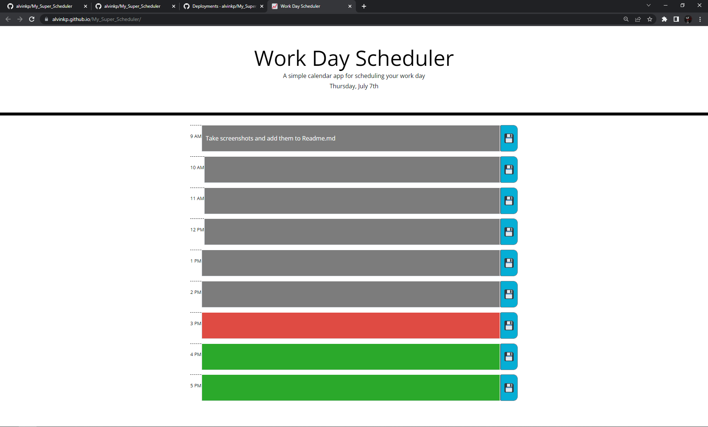
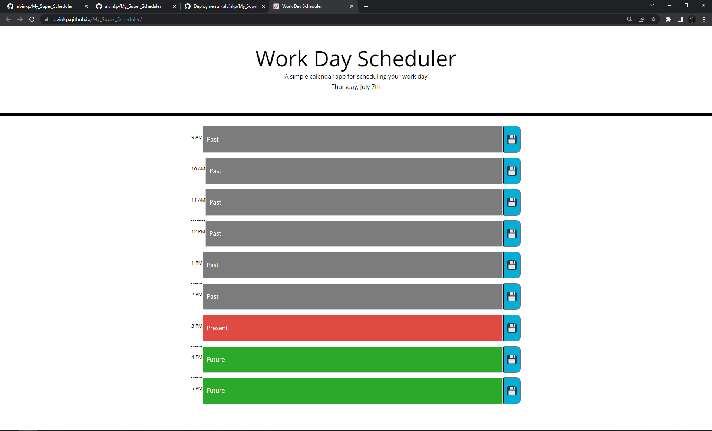

# My_Super_Scheduler

This was the fifth challenge assignment for our UPENN Bootcamp. We were tasked with editing an existing codebase to use moment.js and allow the user to plan their day with the tools we provide. (See **User Story** and **Acceptable Criteria** sections below).

---

## 📕 User Story 

AS AN employee with a busy schedule I WANT to add important events to a daily planner SO THAT I can manage my time effectively

---

## ✔️ Acceptable Criteria 

- GIVEN I am using a daily planner to create a schedule
- WHEN I open the planner THEN the current day is displayed at the top of the calendar
- WHEN I scroll down THEN I am presented with time blocks for standard business hours
- WHEN I view the time blocks for that day THEN each time block is color-coded to indicate whether it is in the past, present, or future
- WHEN I click into a time block THEN I can enter an event
- WHEN I click the save button for that time block THEN the text for that event is saved in local storage
- WHEN I refresh the page THEN the saved events persist

---

## 🔧 Optimizations 

### HTML
- Added reset.css
- Added audio elements (save_sound.mp3 and save_error.mp3)
- Added script.js script element

### CSS
- Added animation classes (saveAnim and saveError)
- Added img class to remove blocking of button click events

### Javascript
- Added functionality for adding timeblocks to HTML
- Added functionality for assigning colors to represent past, present and future timeblocks
- Added functionality for animations and sounds to play on button click.

---

## 📷 Screenshots 

---

## 🎯 Deployment

Website: https://alvinkp.github.io/My_Super_Scheduler/

Repository: https://github.com/alvinkp/My_Super_Scheduler

---

## ✉️ Authors 

- [@alvinkp](https://www.github.com/alvinkp)

